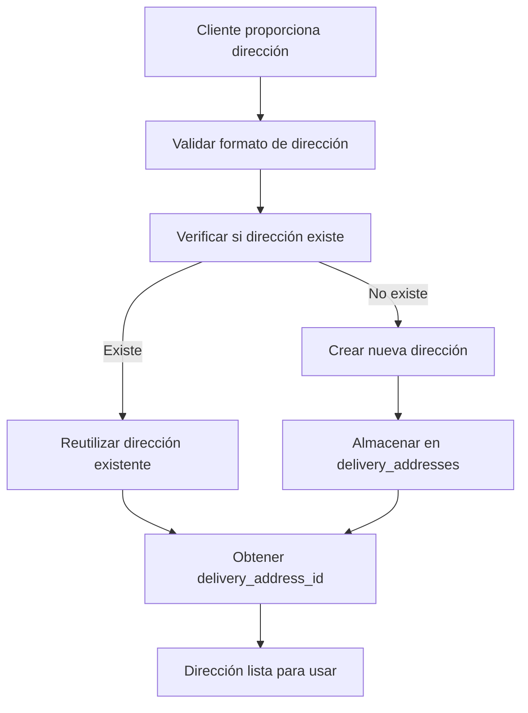
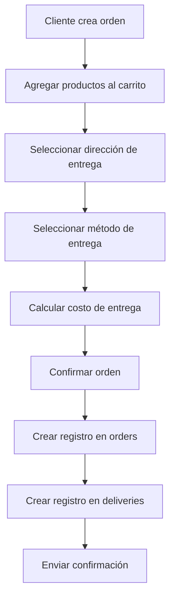
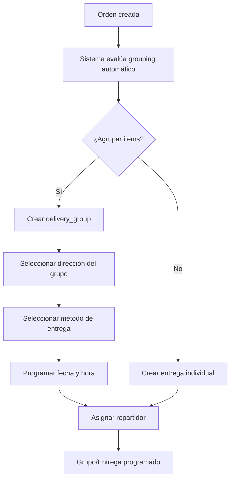
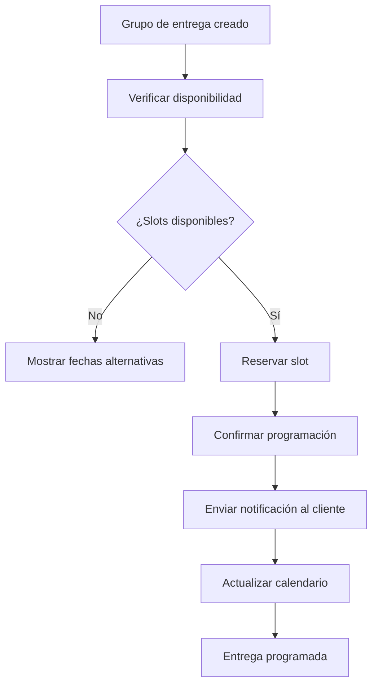
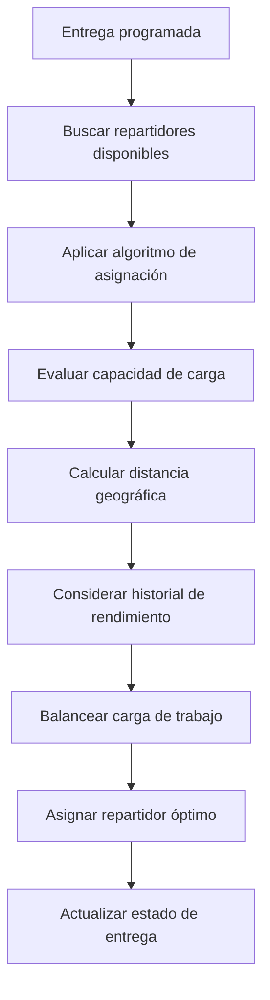
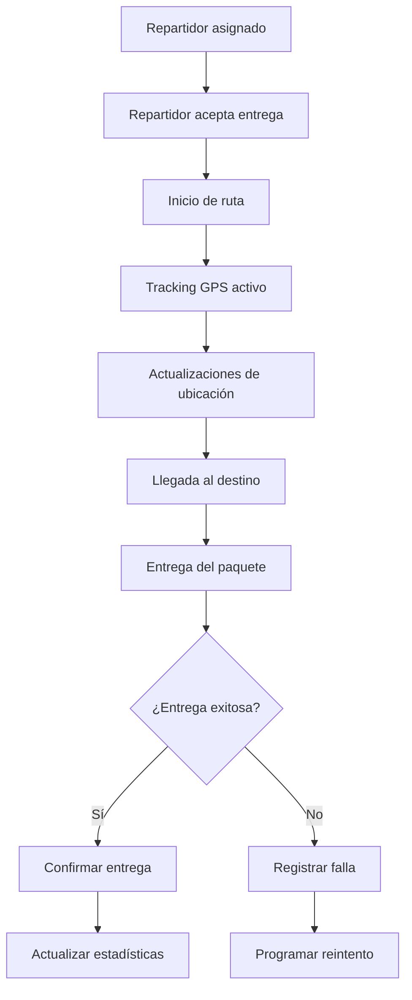
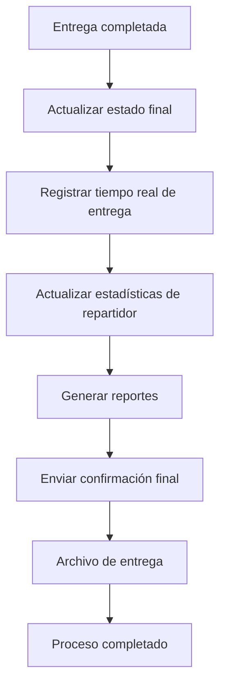

# DOCUMENTACIÓN SEMÁNTICA COMPLETA DEL SISTEMA DE DELIVERY CORREGIDO

## Índice
1. [Arquitectura General](#arquitectura-general)
2. [Semántica de Entidades](#semántica-de-entidades)
3. [Semántica de Atributos](#semántica-de-atributos)
4. [Triggers y Automatización](#triggers-y-automatización)
5. [Vistas y Consultas Optimizadas](#vistas-y-consultas-optimizadas)
6. [Procedimientos y Funciones](#procedimientos-y-funciones)
7. [Flujo de Datos Completo](#flujo-de-datos-completo)
8. [Casos de Uso Principales](#casos-de-uso-principales)

---

## Arquitectura General

El sistema de delivery está diseñado como un módulo modular que maneja todo el ciclo de vida de las entregas, desde la creación de la orden hasta la entrega final al cliente. La arquitectura sigue principios de normalización de datos, trazabilidad completa y escalabilidad.

### Principios de Diseño

1. **Normalización de Datos**: Direcciones reutilizables, métodos estandarizados
2. **Trazabilidad Completa**: Historial de cambios, auditoría automática
3. **Escalabilidad**: Diseño para múltiples tiendas y altos volúmenes
4. **Flexibilidad**: Múltiples métodos de entrega, zonas, repartidores
5. **Automatización**: Triggers, cálculos automáticos, asignaciones inteligentes

---

## Semántica de Entidades

### 1. delivery_addresses
**Propósito**: Normalización y reutilización de direcciones de entrega

**Concepto Semántico**: Representa direcciones físicas únicas que pueden ser reutilizadas por múltiples órdenes o usuarios. Cada dirección tiene identidad propia con coordenadas geográficas, información de contacto y metadata.

**Relaciones**:
- Pertenece a una tienda (store_id)
- Puede asociarse a un usuario específico (user_id)
- Puede vincularse a una orden específica (order_id)
- Referenciada por múltiples grupos de entrega

### 2. delivery_groups
**Propósito**: Organización lógica de productos para entrega

**Concepto Semántico**: Agrupa items de una orden que deben entregarse juntos en una misma dirección y fecha. Permite dividir una orden en múltiples entregas o agrupar items para optimización logística.

**Relaciones**:
- Pertenece a una orden específica (order_id)
- Usa una dirección normalizada (delivery_address_id)
- Aplica un método de entrega (delivery_method_id)
- Puede asignarse a un repartidor (assigned_driver_id)
- Contiene múltiples items (delivery_group_items)

### 3. deliveries
**Propósito**: Registro principal de entregas individuales

**Concepto Semántico**: Representa una entrega física específica con información completa del cliente, dirección, programación y seguimiento. Es la entidad central del sistema de tracking.

**Relaciones**:
- Asociada a una tienda (store_id)
- Vinculada a una orden (order_id)
- Usa un método de entrega (delivery_method_id)
- Asignada a un repartidor (assigned_driver_id)
- Genera notificaciones (delivery_notifications)
- Produce tracking GPS (delivery_tracking)

### 4. delivery_methods
**Propósito**: Configuración de opciones de entrega disponibles

**Concepto Semántico**: Define las diferentes modalidades de entrega que ofrece cada tienda, incluyendo costos, tiempos, restricciones y áreas de cobertura.

**Relaciones**:
- Pertenece a una tienda (store_id)
- Utilizado por múltiples entregas (deliveries)
- Utilizado por múltiples grupos (delivery_groups)
- Define áreas de cobertura en coverage_areas (JSON)

### 5. delivery_drivers
**Propósito**: Gestión de repartidores y su capacidad operativa

**Concepto Semántico**: Representa a las personas responsables de realizar las entregas, con información personal, capacidades de vehículo, horarios de trabajo y estadísticas de rendimiento.

**Relaciones**:
- Pertenece a una tienda (store_id)
- Asignado a múltiples entregas (deliveries)
- Genera tracking GPS (delivery_tracking)
- Tiene estadísticas calculadas automáticamente

### 6. delivery_schedules
**Propósito**: Gestión de disponibilidad temporal para entregas

**Concepto Semántico**: Controla qué fechas y franjas horarias están disponibles para programar entregas, con capacidad por slot y control de bloqueo.

**Relaciones**:
- Pertenece a una tienda (store_id)
- Usado para validar disponibilidad de slots
- Actualizado automáticamente por triggers

### 7. delivery_status_history
**Propósito**: Auditoría completa de cambios de estado

**Concepto Semántico**: Mantiene un registro histórico de todos los cambios de estado en las entregas, incluyendo quién hizo el cambio, cuándo y por qué razón.

**Relaciones**:
- Asociada a una entrega específica (delivery_id)
- Puede referenciar al usuario que hizo el cambio (changed_by)
- Generada automáticamente por triggers

### 8. delivery_notifications
**Propósito**: Sistema de comunicación con clientes

**Concepto Semántico**: Gestiona el envío de notificaciones por múltiples canales (SMS, email, push, WhatsApp) relacionadas con el estado de las entregas.

**Relaciones**:
- Asociada a una entrega específica (delivery_id)
- Maneja diferentes tipos de notificación
- Controla estado de envío y reintentos

### 9. delivery_tracking
**Propósito**: Seguimiento GPS en tiempo real

**Concepto Semántico**: Almacena datos de geolocalización del repartidor y la entrega para proporcionar seguimiento en tiempo real y análisis de rutas.

**Relaciones**:
- Asociada a una entrega específica (delivery_id)
- Vinculada a un repartidor (driver_id)
- Contiene coordenadas y metadata de ubicación

### 10. delivery_zone_costs
**Propósito**: Cálculo dinámico de costos por zona geográfica

**Concepto Semántico**: Define la estructura de precios para diferentes zonas geográficas, permitiendo costos variables según ubicación.

**Relaciones**:
- Pertenece a una tienda (store_id)
- Usado para cálculos de costos automáticos
- Basado en patrones de ciudad

---

## Semántica de Atributos

### Atributos de Identificación

| Atributo | Semántica | Ejemplo |
|----------|-----------|---------|
| id | Identificador único incremental | 1, 2, 3... |
| store_id | Identificador de la tienda propietaria | 1, 2, 3... |
| order_id | Referencia a la orden original | 1001, 1002... |

### Atributos de Contacto

| Atributo | Semántica | Dominio |
|----------|-----------|---------|
| contact_name | Nombre completo del destinatario | "Juan Pérez García" |
| phone | Teléfono de contacto | "+56912345678" |
| email | Correo electrónico | "juan.perez@email.com" |

### Atributos de Dirección

| Atributo | Semántica | Dominio |
|----------|-----------|---------|
| address_line_1 | Dirección principal | "Av. Providencia 1234" |
| address_line_2 | Detalles adicionales | "Depto 501, Torre A" |
| city | Ciudad de entrega | "Santiago" |
| postal_code | Código postal | "7500000" |
| latitude/longitude | Coordenadas GPS | -33.4569, -70.6483 |

### Atributos de Estado

| Atributo | Semántica | Valores Válidos |
|----------|-----------|-----------------|
| status | Estado actual del proceso | pendiente, programada, en_preparacion, en_transito, entregada, fallida, cancelada |
| priority | Prioridad de la entrega | baja, normal, alta, urgente |
| type | Clasificación del objeto | home, work, other |

### Atributos Temporales

| Atributo | Semántica | Formato |
|----------|-----------|---------|
| scheduled_date | Fecha programada | YYYY-MM-DD |
| delivery_time_slot | Franja horaria | morning, afternoon, evening, anytime |
| estimated_delivery_time | Tiempo estimado | YYYY-MM-DD HH:MM:SS |
| actual_delivery_time | Tiempo real de entrega | YYYY-MM-DD HH:MM:SS |

### Atributos de Costos

| Atributo | Semántica | Formato |
|----------|-----------|---------|
| base_cost | Costo base de la entrega | DECIMAL(10,2) |
| shipping_cost | Costo de envío específico | DECIMAL(10,2) |
| cost_multiplier | Multiplicador por zona | DECIMAL(4,2) |

### Atributos de Capacidad

| Atributo | Semántica | Unidad |
|----------|-----------|--------|
| max_weight_capacity | Capacidad máxima de peso | kg |
| max_volume_capacity | Capacidad máxima de volumen | litros |
| slots_available | Slots disponibles | entero |
| slots_booked | Slots reservados | entero |

---

## Triggers y Automatización

### 1. log_delivery_creation
**Propósito**: Auditoría automática al crear entregas

**Evento**: AFTER INSERT en tabla `deliveries`

**Lógica**:
- Inserta registro en `delivery_activity_log`
- Registra creación con información del cliente
- Identifica origen como 'system'

**Semántica**: Garantiza trazabilidad completa desde el momento de creación de cualquier entrega.

### 2. update_driver_stats_after_delivery
**Propósito**: Actualización automática de estadísticas de repartidores

**Evento**: AFTER UPDATE en tabla `deliveries` cuando cambia status

**Lógica**:
- Incrementa total_deliveries del repartidor
- Incrementa successful_deliveries si status = 'entregada'
- Incrementa failed_deliveries si status = 'fallida' o 'cancelada'

**Semántica**: Mantiene estadísticas actualizadas sin intervención manual, proporcionando métricas en tiempo real.

### 3. delivery_groups_status_change_log
**Propósito**: Registro de cambios en grupos de entrega

**Evento**: AFTER UPDATE en tabla `delivery_groups` cuando cambia status

**Lógica**:
- Registra el cambio de estado anterior a nuevo
- Almacena descripción del cambio
- Vincula con actividad log

**Semántica**: Proporciona historial detallado de la evolución de cada grupo de entrega.

---

## Vistas y Consultas Optimizadas

### 1. v_active_delivery_groups
**Propósito**: Consulta rápida de grupos de entrega activos

**Componentes**:
- Información completa del grupo
- Datos del método de entrega
- Detalles de la dirección normalizada
- Información del repartidor asignado
- Métricas agregadas (items, peso total)

**Uso**: Dashboard operativo, monitoreo en tiempo real

### 2. view_deliveries_complete
**Propósito**: Vista completa de entregas con información relacionada

**Componentes**:
- Datos completos de la entrega
- Información del método de entrega
- Datos del repartidor
- Información de la orden original
- Calculados: días hasta entrega, entregas vencidas, retrasos

**Uso**: Reportes detallados, análisis de rendimiento

### 3. view_driver_performance
**Propósito**: Métricas de rendimiento de repartidores

**Componentes**:
- Datos personales del repartidor
- Estadísticas calculadas: tasa de éxito, tasa de falla
- Disponibilidad en tiempo real
- Tiempos promedio de entrega

**Uso**: Evaluación de rendimiento, asignación óptima

### 4. v_delivery_statistics
**Propósito**: Estadísticas agregadas por período

**Componentes**:
- Entregas por día y tienda
- Conteos por estado
- Revenue total y promedio
- Ciudades atendidas
- Repartidores utilizados

**Uso**: Análisis de tendencias, reportes gerenciales

---

## Procedimientos y Funciones

### 1. GetPendingDeliveries(p_store_id)
**Propósito**: Obtener entregas pendientes de asignar

**Parámetros**:
- p_store_id: ID de la tienda

**Lógica**:
- Busca entregas con status 'pendiente'
- Sin repartidor asignado
- Fecha programada vigente o nula
- Ordena por prioridad y fecha

**Retorno**: Lista de entregas pendientes optimizada

### 2. AssignBestDriver(p_delivery_id)
**Propósito**: Asignación automática del mejor repartidor disponible

**Parámetros**:
- p_delivery_id: ID de la entrega

**Lógica**:
- Evalúa capacidad de peso
- Verifica disponibilidad horaria
- Calcula distancia geográfica
- Considera historial de rendimiento
- Balancea carga de trabajo

**Retorno**: Mensaje de confirmación o error

### 3. createDeliveryGroupFixed()
**Propósito**: Crear grupo de entrega con estructura corregida

**Parámetros**:
- p_order_id: ID de la orden
- p_delivery_address_id: ID de la dirección normalizada
- p_delivery_date: Fecha de entrega
- p_delivery_time_slot: Franja horaria
- p_delivery_notes: Notas opcionales

**Lógica**:
- Valida datos de entrada
- Genera nombre automático del grupo
- Inserta registro en delivery_groups
- Registra actividad de auditoría
- Retorna ID del grupo creado

**Retorno**: p_group_id y confirmación

### 4. sp_calculate_delivery_cost()
**Propósito**: Cálculo dinámico de costos de entrega

**Parámetros**:
- p_store_id: ID de la tienda
- p_method_id: ID del método
- p_city: Ciudad de destino
- p_weight: Peso en kg
- p_volume: Volumen en litros
- p_distance_km: Distancia en km

**Lógica**:
- Obtiene costo base del método
- Aplica recargos por peso y distancia
- Determina multiplicador por zona
- Calcula costo total
- Estima días de entrega

**Retorno**: Desglose completo de costos

### 5. sp_check_delivery_availability()
**Propósito**: Verificar disponibilidad de slots de entrega

**Parámetros**:
- p_store_id: ID de la tienda
- p_date: Fecha a consultar
- p_time_slot: Franja horaria

**Lógica**:
- Busca slot en delivery_schedules
- Si no existe, lo crea automáticamente
- Calcula slots disponibles
- Verifica estado de bloqueo
- Determina status final

**Retorno**: Disponibilidad y estado del slot

---

## Flujo de Datos Completo

### Fase 1: Creación de Dirección de Delivery

**Semántica**: 
- **Normalización**: Direcciones se normalizan para evitar duplicados
- **Reutilización**: Una dirección puede usarse en múltiples órdenes
- **Geolocalización**: Se asignan coordenadas cuando están disponibles

### Fase 2: Creación de Orden con Delivery

**Semántica**:
- **Integración**: Sistema de delivery integrado con órdenes
- **Cálculo Automático**: Costos calculados según zona y método
- **Confirmación**: Proceso completo de validación antes de crear

### Fase 3: Organización en Grupos de Entrega

**Semántica**:
- **Optimización**: Agrupación automática para eficiencia
- **Flexibilidad**: Permite entregas divididas o agrupadas
- **Programación**: Asignación inteligente de recursos

### Fase 4: Programación de Entrega

**Semántica**:
- **Capacidad**: Control de capacidad por slot temporal
- **Disponibilidad**: Sistema de reservas en tiempo real
- **Confirmación**: Notificación automática al cliente

### Fase 5: Asignación de Repartidor

**Semántica**:
- **Optimización**: Algoritmo multi-criterio para mejor asignación
- **Balance**: Distribución equitativa de trabajo
- **Eficiencia**: Minimización de tiempo y distancia

### Fase 6: Ejecución de Entrega

**Semántica**:
- **Seguimiento**: Monitoreo en tiempo real del progreso
- **Confirmación**: Validación de entrega exitosa
- **Gestión de Fallas**: Manejo de situaciones excepcionales

### Fase 7: Cierre y Auditoría

**Semántica**:
- **Cierre**: Finalización formal del proceso
- **Auditoría**: Registro completo para trazabilidad
- **Métricas**: Actualización de KPIs del sistema

---

## Casos de Uso Principales

### Caso de Uso 1: Cliente Realiza Pedido con Delivery

**Actor**: Cliente

**Flujo Principal**:
1. Cliente navega productos
2. Agrega productos al carrito
3. Ingresa datos de envío
4. Sistema busca/crea dirección normalizada
5. Cliente selecciona método de entrega
6. Sistema calcula costo total
7. Cliente confirma orden
8. Sistema crea entrega y programa

**Flujo Alternativo - Dirección Existente**:
1. Cliente selecciona dirección guardada
2. Sistema reutiliza delivery_address_id existente
3. Continúa con flujo principal

**Puntos de Validación**:
- Dirección válida y completa
- Método de entrega disponible para la zona
- Capacidad del repartidor
- Slot de tiempo disponible

### Caso de Uso 2: Administrador Gestiona Entregas

**Actor**: Administrador de tienda

**Flujo Principal**:
1. Visualiza dashboard de entregas activas
2. Ve entregas pendientes de asignación
3. Revisa disponibilidad de repartidores
4. Asigna repartidores manualmente o usa asignación automática
5. Monitorea entregas en progreso
6. Resuelve problemas de entrega

**Funcionalidades**:
- Filtros por estado, fecha, repartidor
- Mapa de entregas en tiempo real
- Comunicación con repartidores
- Reprogramación de entregas

### Caso de Uso 3: Repartidor Ejecuta Ruta

**Actor**: Repartidor

**Flujo Principal**:
1. Repartidor revisa entregas asignadas
2. Sistema optimiza ruta
3. Repartidor confirma inicio de ruta
4. Sistema activa tracking GPS
5. Repartidor actualiza estados en cada parada
6. Cliente recibe notificaciones de progreso
7. Repartidor confirma entregas exitosas

**Funcionalidades**:
- Navegación GPS integrada
- Actualización de estados
- Captura de firmas y fotos
- Comunicación con clientes

### Caso de Uso 4: Análisis de Rendimiento

**Actor**: Gerencia

**Flujo Principal**:
1. Accede a reportes de delivery
2. Filtra por período y métricas
3. Analiza tendencias y patrones
4. Identifica oportunidades de mejora
5. Toma decisiones estratégicas

**Métricas Clave**:
- Tasa de entrega exitosa
- Tiempo promedio de entrega
- Satisfacción del cliente
- Costos operacionales
- Utilización de repartidores

---

## Consideraciones de Implementación

### Rendimiento
- Índices optimizados para consultas frecuentes
- Vistas materializadas para reportes pesados
- Caché de cálculos complejos
- Particionamiento para grandes volúmenes

### Escalabilidad
- Arquitectura distribuida para múltiples tiendas
- Separación de lectura/escritura
- Balanceo de carga para tracking GPS
- API REST para integración externa

### Seguridad
- Validación de entrada en todos los procedimientos
- Auditoría completa de cambios
- Cifrado de datos sensibles
- Control de acceso basado en roles

### Mantenimiento
- Procedimientos de backup automatizados
- Monitoreo de performance
- Alertas proactivas
- Documentación actualizada

---

## Conclusión

El sistema de delivery corregido proporciona una base sólida y escalable para la gestión completa de entregas. La normalización de direcciones, la trazabilidad completa y la automatización de procesos aseguran una operación eficiente y una experiencia superior al cliente.

La arquitectura modular permite extensiones futuras y la integración con servicios externos, mientras que las métricas integradas proporcionan visibilidad completa del rendimiento operacional.
